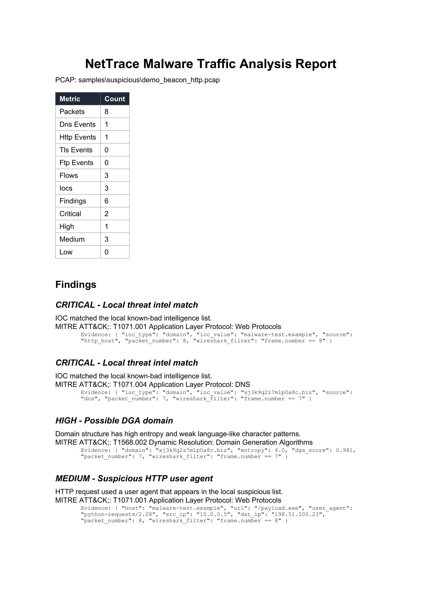

# NetTrace

[](https://github.com/rootverdict/NetTrace/actions/workflows/ci.yml)


[](LICENSE)

NetTrace is a Python malware traffic analysis platform for offline PCAP analysis. It extracts network artifacts, identifies suspicious behavior, maps findings to MITRE ATT&CK techniques, and generates analyst-ready JSON, HTML, and PDF reports.

The project is designed for malware traffic analysis, SOC triage, threat hunting practice, and detection engineering work.



Quick proof: [PDF demo report](docs/demo/demo_beacon_http_report.pdf) | [HTML demo report](docs/demo/demo_beacon_http_report.html) | [validation matrix](docs/VALIDATION.md) | [benchmarks](docs/BENCHMARKS.md) | [version scope](docs/VERSION_SCOPE.md)

## What NetTrace Does

- Parses PCAP files in a single pass
- Supports IPv4 and IPv6 packet metadata
- Reassembles bounded TCP streams for HTTP, TLS ClientHello, and FTP control traffic
- Extracts UDP and TCP DNS queries, responses, and per-answer TTLs
- Extracts plaintext HTTP methods, hosts, URIs, URLs, and user agents
- Extracts TLS ClientHello SNI values on common TLS ports
- Builds IP flow and conversation metadata
- Extracts IOCs including domains, URLs, and public IP addresses
- Filters internal/private IPs and known public DNS resolvers from IOC output
- Detects beaconing using interval regularity
- Scores possible DGA domains using entropy and character-pattern analysis
- Applies a DGA allowlist for Windows, Microsoft, local, and known-good infrastructure
- Detects suspicious HTTP behavior and executable/script downloads
- Detects cleartext FTP credentials and file uploads without recording passwords
- Detects high-frequency flows and unusual ports
- Supports local IOC matching
- Supports optional MISP enrichment
- Maps findings to MITRE ATT&CK
- Scores finding severity
- Builds a chronological activity timeline
- Adds packet numbers and Wireshark `frame.number` filters to report evidence
- Exports JSON, HTML, and PDF reports
- Applies configurable flow, event, aggregate TCP stream-buffer, and timeline limits with report warnings

## Architecture

```text
PCAP input
  |
  v
Parser layer
  - DNS extractor
  - HTTP extractor
  - TLS SNI extractor
  - Flow builder
  |
  v
Analysis layer
  - Beaconing detector
  - DGA scorer
  - HTTP analyzer
  - TLS analyzer
  - Port and frequency analyzer
  - IOC extractor
  |
  v
Intel and mapping layer
  - Local IOC lookup
  - Optional MISP lookup
  - MITRE ATT&CK tagging
  - Severity scoring
  - Timeline building
  |
  v
Report layer
  - JSON findings
  - HTML report
  - PDF report
```

## Design Decisions

- **Behavior before labels:** NetTrace reports observable patterns such as regular callback intervals, suspicious downloads, and unusual ports instead of claiming a malware-family verdict from network traffic alone.
- **Reassemble before parsing:** bounded IP and TCP reassembly recovers protocol messages split across packets while limiting memory use on malformed or adversarial captures.
- **Explainable detections:** findings retain packet numbers, evidence, and Wireshark filters so an analyst can verify each signal against the original capture.
- **Offline-first enrichment:** local IOC matching works without sharing capture data; MISP integration is optional for teams that operate their own threat-intelligence service.
- **Machine and analyst outputs:** JSON supports automation, while HTML and PDF provide portable reports for investigation and review.

Beaconing uses interval regularity because command-and-control callbacks often repeat on a cadence even when payload contents are encrypted. NetTrace treats that cadence as a triage signal and combines it with flow volume, destination context, and other findings to reduce overconfident conclusions.

## Project Structure

```text
NetTrace/
|-- pyproject.toml
|-- LICENSE
|-- main.py
|-- config.yaml
|-- FINDINGS.md
|-- docs/
|   |-- VALIDATION.md
|   |-- BENCHMARKS.md
|   |-- assets/
|   |-- demo/
|-- findings/
|-- requirements.txt
|-- nettrace/
|   |-- analysis/
|   |-- data/
|   |-- intel/
|   |-- mapping/
|   |-- models/
|   |-- parsers/
|   |-- report/
|   |-- rules/
|-- samples/
|-- tests/
|-- tools/
```

## Install

On Windows, the reproducible setup script checks for Python 3.12, creates `.venv`, installs the project, and runs the test suite:

```powershell
powershell -NoProfile -ExecutionPolicy Bypass -File .\tools\setup_dev.ps1
```

To deliberately recreate an existing `.venv`:

```powershell
powershell -NoProfile -ExecutionPolicy Bypass -File .\tools\setup_dev.ps1 -Recreate
```

Manual setup is also supported:

Create and activate a virtual environment:

```powershell
py -3.12 -m venv .venv
.\.venv\Scripts\activate
```

Install dependencies:

```powershell
pip install -e ".[dev]"
```

This installs the `nettrace` console command and the test dependency. If you prefer the simple script workflow, `pip install -r requirements.txt` also works.

## Run Tests

```powershell
python -m pytest --cov=nettrace --cov-report=term
```

Expected result:

```text
110+ tests pass and total coverage remains at or above the enforced 80% threshold.
```

The same checks run automatically on Python 3.11 and 3.12 through GitHub Actions.

## Run the Safe Demo

Generate a safe synthetic PCAP:

```powershell
python tools\generate_demo_pcap.py
```

Analyze it:

```powershell
nettrace samples\suspicious\demo_beacon_http.pcap -o output
```

You can also run the same CLI through the repository entry point:

```powershell
python main.py samples\suspicious\demo_beacon_http.pcap -o output
```

Generated outputs:

- `output/demo_beacon_http_findings.json`
- `output/demo_beacon_http_report.html`
- `output/demo_beacon_http_report.pdf`
- `findings/demo_beacon_http_FINDINGS.md`

The Markdown analyst write-up is generated automatically. You can also regenerate it from the JSON report:

```powershell
python tools\generate_findings_md.py output\demo_beacon_http_findings.json
```

By default, this creates:

```text
findings/demo_beacon_http_FINDINGS.md
```

## Analyze a PCAP

```powershell
nettrace path\to\traffic.pcap -o output
```

Script-style execution is still supported:

```powershell
python main.py path\to\traffic.pcap -o output
```

Optional flags:

- `--no-json` - skip JSON export
- `--no-html` - skip HTML report
- `--no-pdf` - skip PDF report
- `--no-md` - skip Markdown analyst findings
- `--md-output path\to\file.md` - write Markdown findings to a custom path
- `--source "Dataset name"` - add source metadata to Markdown findings
- `--source-url "https://example.test"` - add source URL metadata to Markdown findings
- `-c config.yaml` - use a custom config file

## Generate Analyst Findings

NetTrace can turn a JSON findings report into a Markdown analyst write-up:

```powershell
python tools\generate_findings_md.py output\real\2023-03-17-Emotet-E5-infection-traffic_findings.json --source "Malware-Traffic-Analysis.net - 2023-03-17 Emotet Epoch 5 Activity" --source-url "https://www.malware-traffic-analysis.net/2023/03/17/index.html"
```

By default, the script writes one separate file per scan:

```text
findings/2023-03-17-Emotet-E5-infection-traffic_FINDINGS.md
```

To create or update the root showcase report, pass `-o FINDINGS.md`:

```powershell
python tools\generate_findings_md.py output\real\2023-03-17-Emotet-E5-infection-traffic_findings.json -o FINDINGS.md --source "Malware-Traffic-Analysis.net - 2023-03-17 Emotet Epoch 5 Activity" --source-url "https://www.malware-traffic-analysis.net/2023/03/17/index.html"
```

The generated Markdown includes:

- dataset metadata
- summary counts
- analyst paragraph
- finding type counts
- ATT&CK techniques
- notable URLs
- notable domains
- notable IPs and ports
- triage notes

## Real Malware Traffic Analysis

NetTrace was validated against 5 real public Malware-Traffic-Analysis.net PCAP samples across multiple malware families and traffic patterns:

- Emotet Epoch 5 - staging URLs and command-and-control traffic
- Raspberry Robin - loader/worm-style infection traffic
- Redtail - Linux malware and server-side infection traffic
- AgentTesla - credential-stealer traffic using FTP behavior
- NetSupport RAT - remote access malware traffic

The large real PCAPs are intentionally not stored in Git. Their source URLs, extracted-file sizes, and SHA-256 hashes are recorded in `samples/real/manifest.json`. Existing local copies remain usable.

Verify local copies without network access:

```powershell
python tools\fetch_real_pcaps.py --verify-only
```

To download the password-protected source archives, read the source warning and password scheme first, then provide the password through `NETTRACE_PCAP_PASSWORD`:

```powershell
$env:NETTRACE_PCAP_PASSWORD = "<password from source site>"
python tools\fetch_real_pcaps.py --accept-risk
```

Validation corpus filenames:

- `samples/real/2023-03-17-Emotet-E5-infection-traffic.pcap`
- `samples/real/2024-11-14-Raspberry-Robin-infection-traffic.pcap`
- `samples/real/2024-11-24-infection-by-Redtail-bash-script-from-45.202.35_190.pcap`
- `samples/real/2024-12-04-AgentTesla-variant-using-FTP.pcap`
- `samples/real/2024-12-17-SmartApeSG-to-NetSupport-RAT.pcap`

Showcase analysis:

- Source page: `https://www.malware-traffic-analysis.net/2023/03/17/index.html`
- Dataset: `2023-03-17 - Emotet Epoch 5 Activity`
- Analysis write-up: `FINDINGS.md`

The Emotet showcase analysis produced:

- 327 DNS events
- 8 plaintext HTTP requests
- 32 TLS SNI events
- 813 flows
- 180 IOCs
- 32 findings

The analyst write-up identifies Emotet staging URLs, C2 infrastructure, high-frequency encrypted flows, and ATT&CK-mapped behavior.

## Validation And Performance

The [validation matrix](docs/VALIDATION.md) compares source-described behavior with extracted NetTrace evidence and records heuristic limitations without claiming an unsupported global detection rate.

The five-capture benchmark corpus contains 171,530 packets and 41,577 flows. On the documented Windows/Python 3.12 system, individual analysis runs took 0.081 to 44.470 seconds with observed peak process memory between 76.5 and 151.9 MiB. See [BENCHMARKS.md](docs/BENCHMARKS.md) for the complete table, environment, caveats, and reproduction command.

## Known Limitations

- Flow direction is inferred from TCP SYN/SYN-ACK when available, then private-to-public and service-port heuristics. Ambiguous one-direction mid-session captures can still report direction incorrectly.
- The generated analyst paragraph identifies the busiest internal host as the likely victim. In multi-host captures, treat this as a triage heuristic rather than ground truth.
- Demo traffic uses documentation-range addresses where applicable. Real IOC analysis filters documentation, private, loopback, link-local, multicast, reserved, unspecified, and known resolver IPs from public-IP IOC output.

## Detection Rules

Rules and tunable values live in `nettrace/rules/`:

- `attck_map.yaml` - maps finding categories to MITRE ATT&CK techniques
- `thresholds.yaml` - stores detection thresholds
- `suspicious_ports.yaml` - lists suspicious or non-standard ports
- `dga_allowlist.yaml` - suppresses known benign DGA false positives

Additional plaintext HTTP ports can be configured under `protocols.http_ports` in `config.yaml`. Complete HTTP request signatures are also detected packet-by-packet on unusual ports, while bounded stream reassembly remains limited to the configured port set.

## MISP Integration

MISP enrichment is optional. NetTrace works offline with local IOC lists in `nettrace/data/`.

To enable MISP without storing credentials in the repository, set the API key in an environment variable and edit `config.yaml`:

```powershell
$env:NETTRACE_MISP_API_KEY = "YOUR_API_KEY"
```

```yaml
misp:
  enabled: true
  url: "https://misp.example.local"
  api_key_env: NETTRACE_MISP_API_KEY
  verify_ssl: true
  max_iocs: 5000
  batch_size: 100
  timeout_seconds: 10
```

## Technical Notes

- PCAP files are processed in a single pass.
- NetTrace keeps bounded event and flow metadata, not every raw packet. Limits are configurable under `limits` in `config.yaml`.
- Reports include packet references so findings can be rechecked in Wireshark with `frame.number` filters.
- HTTP parsing is plaintext HTTP only.
- HTTPS payloads cannot be inspected unless the traffic is decrypted before analysis.
- TLS analysis focuses on SNI, destination IP, port, timing, and flow duration.
- TCP reassembly buffers a bounded number of out-of-order segments; streams with persistent gaps or exhausted limits are discarded.
- IPv4 and IPv6 fragment reassembly is bounded; incomplete, overlapping, or invalid fragmented datagrams are discarded with a report warning.
- PDF reports are generated with ReportLab for a Windows-friendly Python setup.
- Scapy may print `No libpcap provider available` on Windows. This is harmless for offline PCAP parsing.

## Limitations

- DGA scoring is heuristic and should be reviewed by an analyst.
- Encrypted traffic analysis is metadata-based unless decrypted traffic is available.
- High-frequency flow detection can include benign large transfers and should be triaged with context.
- Local IOC lists are demonstration data unless replaced with operational threat intelligence.

## Safety

NetTrace analyzes packet captures only. Do not execute malware on a host operating system. Use isolated virtual machines for malware detonation, sample handling, or live infection-lab work.

## Author

Aryan - MSc DFIS, NFSU Gandhinagar

